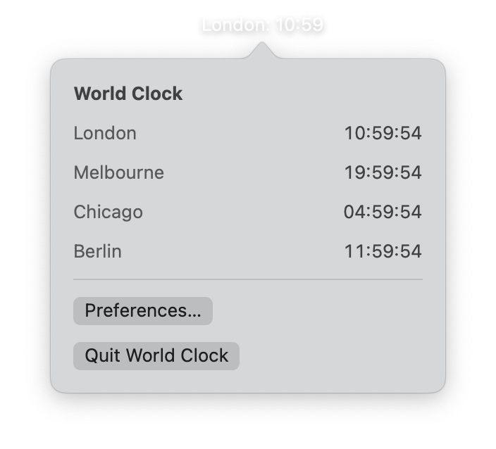
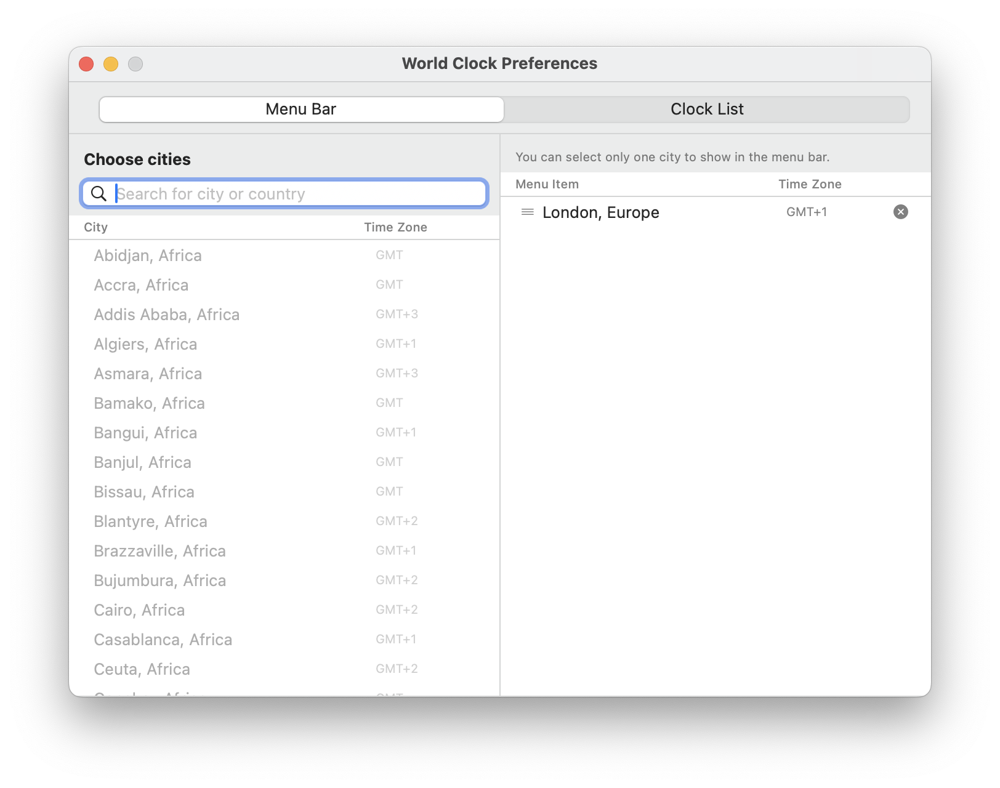
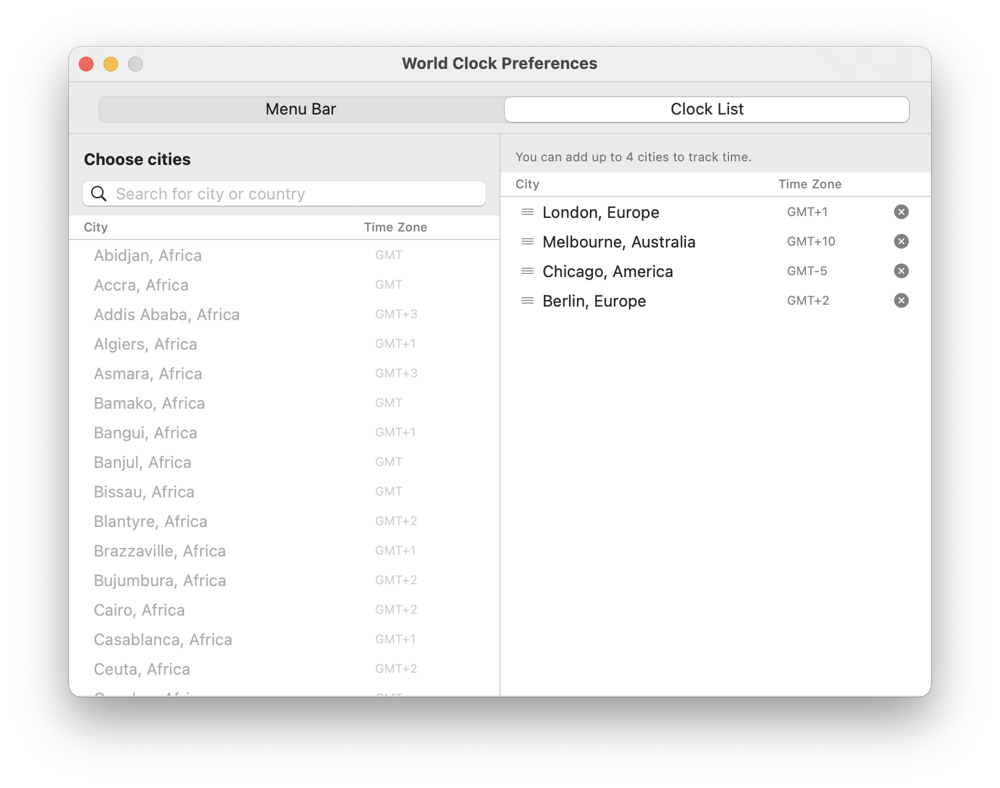

<p align="center">
  
</p>

<h1 align="center">World Clock Live</h1>

<p align="center">
  A clean, minimal macOS menu bar app to track time across multiple cities — effortlessly.
</p>

<p align="center">
  
  
  
</p>

<br />

<p align="center">
  
</p>

---

## Screenshots

<p align="center">
  
  &nbsp;&nbsp;
  
  &nbsp;&nbsp;
  
</p>

<p align="center">
  
</p>

---

## Features

- **Add up to 4 cities** — Monitor multiple time zones at once in a clean, focused layout
- **Menu bar clock** — A live clock always visible in your macOS menu bar
- **Custom labels** — Set your own label for each city in both the clock list and menu bar
- **Drag & drop** — Drag a city from the city list and drop it into your clock list or menu bar
- **Merged display** — Compact format like `LON 06:24 · NYC 01:24` in one menu bar item
- **Display tab** — Toggle 24-hour time, seconds, date, and launch at login
- **Clean & minimal UI** — Native macOS design, distraction-free and fast

---

## Requirements

- macOS 14.0 or later
- Xcode 15+

## Installation

```bash
git clone https://github.com/teesma-dev/WorldClockLive.git
```

Open `WorldClockLive.xcodeproj` in Xcode and hit `Cmd + R`.

[⬇️ Download latest ZIP](https://github.com/teesma-dev/WorldClockApp/archive/refs/heads/main.zip)

---

## Built With

- **Swift 5** — Primary language
- **SwiftUI** — UI framework
- **AppKit** — macOS menu bar integration

---

## Developer

<p align="center">
  <strong>Teesma M</strong><br/>
  iOS Developer · Chennai, India
</p>

<p align="center">
  <a href="https://www.linkedin.com/in/teesma/">
    
  </a>
  &nbsp;
  <a href="https://github.com/teesma-dev">
    
  </a>
  &nbsp;
  <a href="https://buymeacoffee.com/teeshmateex">
    
  </a>
</p>

---

## Support

If you find this app useful, consider buying me a coffee — it helps me keep building!

<p align="center">
  <a href="https://buymeacoffee.com/teeshmateex">
    
  </a>
</p>

---

## License

MIT License — see [LICENSE](LICENSE) for details.

---

<p align="center">Made with ❤️ in Chennai, India</p>
